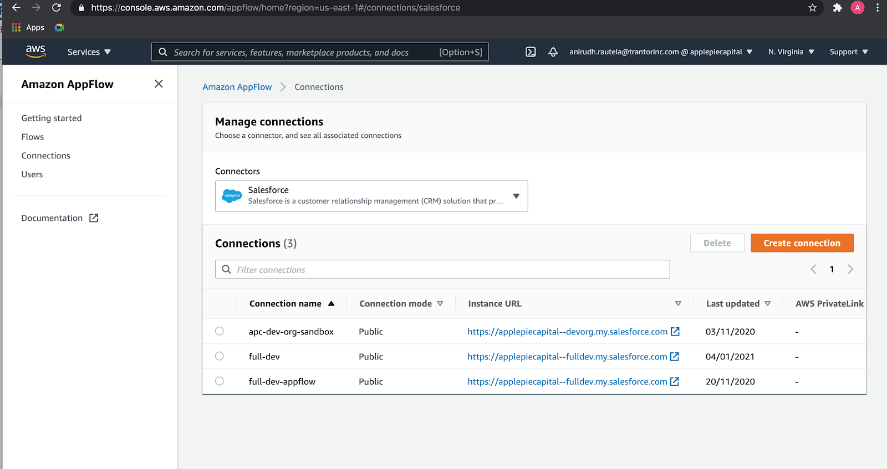
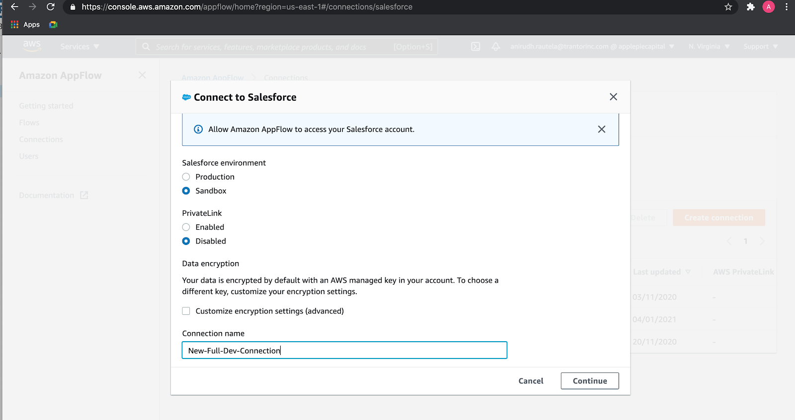
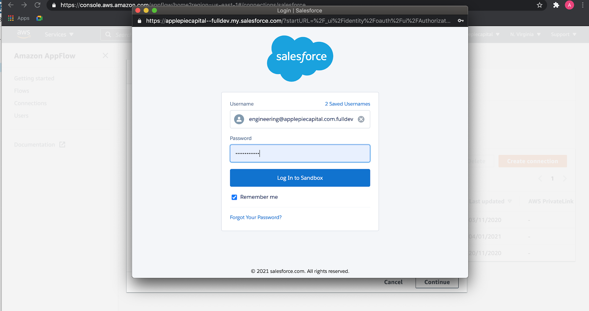
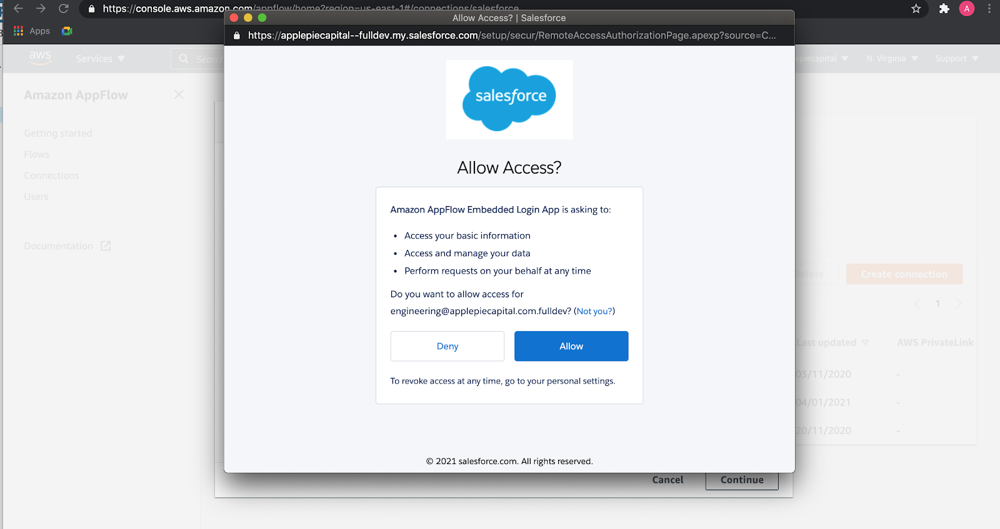

// If no preperation is required, remove all content from here

==== Create AppFlow connection with Salesforce

. Create a new connection in AWS AppFlow
. Go to Connections in AppFlow
. From connectors choose Salesforce
. Then click on Create Connection

[#prereq1]
.Amazon AppFlow connections

[start=5]
. Select Sandbox or Production based on the Salesforce instance type and add a new name in connection name. Then click on Continue.

[#prereq2]
.Create new connection

[start=6]
. Add credentials of Salesforce user account and click on Log In

[#prereq3]
.Entering Salesforce credentials

[start=7]
. Click on *Allow* to allow access

[#prereq4]
.Allowing AppFlow access to Salesforce

[start=8]
. Verify that the new connection name is listed in connections list. Note that this connection name will be needed when deploying the Quick Start.

[#prereq4]
.Amazon AppFlow connections

